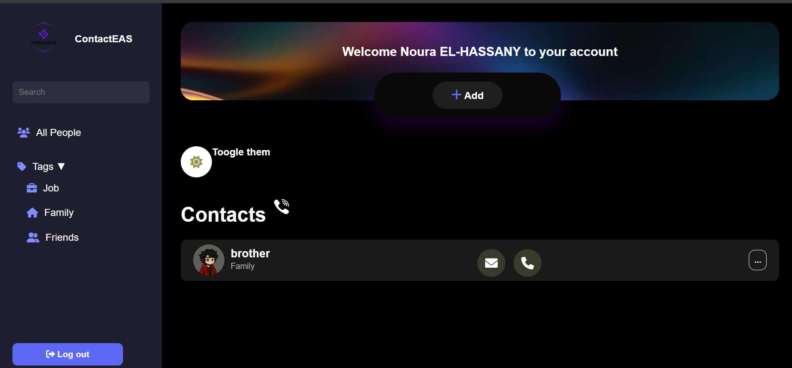

# 💼 Contacteas 🌟

✨ **Manage Your Contacts Easily**  
Beautiful and interactive web application for managing personal contacts with **add, edit, and delete features**.  

HTML5 | CSS3 | PHP | JS |  MySQL 

---

## ✨ Project Description
Contacteas is a **personal project** for managing contacts efficiently.  
It features a **modern, clean interface** that allows users to:  
- **Add new contacts** (name, email, phone, tag)  
- **Edit existing contacts**  
- **Delete contacts**  

The app is **responsive**, working perfectly on **desktop, and mobile devices**.

---

## 🔧 Key Features
📝 **Contact Management**  
- Add, edit, delete contacts  
- Tag contacts for better organization  
- Optional profile images  

📱 **Responsive Design**  
- Mobile-first approach  
- Card-based layout for contact display  
- Works seamlessly on all devices  

💾 **Data Handling**  
- PHP backend handles contact operations  
- Optional MySQL database for persistent storage  

🎨 **User Interface**  
- Elegant typography  
- Subtle shadows and color highlights  
- Intuitive and interactive forms  

---

## 🛠️ Technologies Used
- HTML5  
- CSS3  
- PHP  
- MySQL 
- JavaScript 

---

## ⚙️ Installation Steps
📥 Clone the repository:
```bash
git clone https://github.com/Noura-ELH/contacts-telephonique-project.git

📂 Navigate to the project folder:
cd contacts-telephonique-project

📦 Place it in your local server (XAMPP/WAMP/MAMP)
🌐 Open index.php in your browser

📷 Screenshots & Demo

Home Screen


Dashboard Screen



🤝 Contributing

Contributions are welcome! Submit a pull request or report issues.

Ways to Contribute:
🐛 Report Bugs
💡 Suggest Features
🔧 Submit Pull Requests
📖 Improve Documentation

Steps:

Fork the repository

Create your feature branch: git checkout -b feature/AmazingFeature

Commit your changes: git commit -m 'Add some AmazingFeature'

Push to the branch: git push origin feature/AmazingFeature

Open a Pull Request

⭐ Support

If you like this project, don’t forget to leave a ⭐ on GitHub!

📬 Stay in Touch

👩‍💻 Noura ELH - Project Creator
Email : elhassanynora@gmail.com | GitHub : Noura-ELH  | LinkedIn: Noura El-hassany

Thank you for visiting Contacteas! 💼✨